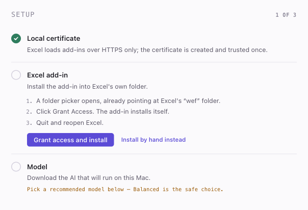
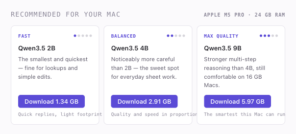

<div align="center">

# Exovelletron

**A private AI assistant that lives inside Microsoft Excel.**

Ask questions about your spreadsheet, and it answers. Ask it to change something, and it
shows you exactly what it will do before it does it.

Everything runs on your own Mac. No account, no API key, no internet after setup.

</div>

---

## What it can do

| | |
|---|---|
| **Explain your data** | "What am I looking at?" — it reads your selection and tells you. |
| **See the whole workbook** | It knows every sheet's shape and reads exactly the ranges it needs — any sheet, any rows — before answering. The transcript shows a receipt for every read. |
| **Get the maths right at any size** | Totals, largest values, counts, lookups — it asks Excel to compute them over *every* row with one formula, so the answer on a 20,000-row sheet is exact, never extrapolated. |
| **Write formulas** | Describe the calculation; it fills the column and adjusts references per row. |
| **Split messy columns** | One cell holding `"NAME 123 MAIN ST","CITY","ST","12345"`? It breaks that into proper named columns. |
| **Rebuild truly messy data** | Records with fields stacked down separate rows, or a dozen records crammed into one cell? It reads the whole range in context and rebuilds it as a clean table — one row per record. |
| **Clean up values** | Standardise addresses to USPS format, fix inconsistent dates, normalise names — across **every row**, not just the ones on screen. |
| **Format the sheet** | Bold headers, fills, currency and date formats. Tables the AI writes pick up the sheet's own header style. |
| **Find problems** | Blanks, duplicates, values that look wrong. |
| **Use the web** *(optional)* | Off by default. Click the globe in the pane and the AI can search DuckDuckGo **and open pages you link it to** — paste a USPS formatting guide and it reads the actual rules. The transcript shows a receipt for every search and every page opened. |

**Nothing is written until you click Apply**, and every change has an **Undo**.

---

## Install

You'll need a Mac with Apple Silicon (any M-series chip) and Microsoft Excel for Mac.
The whole thing takes about five minutes plus one model download.

### 1. Download and open the app

Download the newest `Exovelletron-…-arm64.dmg` from the
[releases page](https://github.com/EthanAckerman-git/exovelletron/releases/latest),
open it, and drag **Exovelletron** into **Applications**.

The first time you open the app, macOS may warn that it's from an unidentified
developer (it isn't notarized with Apple yet). If so: **right-click the app →
Open → Open**. That's only needed once.

### 2. Let the app set itself up

Exovelletron opens with a short checklist and does the work itself:



| Step | What happens | What you do |
|---|---|---|
| **Local certificate** | Excel only loads add-ins over HTTPS, so the app makes itself a certificate. | Type your Mac password once when asked. |
| **Excel add-in** | A folder picker opens, already pointing at the right folder. | Click **Grant Access**. |
| **Model** | The AI itself — picked to match *your* Mac. | Click a download button (see below). |

### 3. Pick your model

The app looks at your Mac's chip and memory and recommends three models — **Fast**,
**Balanced**, and **Max quality**. Every model shows an intelligence rating and whether
it fits your machine, so nothing is a guess. Not sure? **Balanced** is the safe choice.



The download is a few GB and resumes if interrupted. You can switch models any time
with one click — no reinstall, no restart.

### 4. Open it in Excel

Quit Excel fully (⌘Q, not just the window) and reopen it. On the **Home** tab, look at
the **far right end of the ribbon** — there's a new purple **Exovelletron** button.
Click it and the pane opens on the right side of the window.

Select some cells, ask a question, and when the AI proposes a change you'll see a
preview card showing exactly what it wants to do. Nothing touches your sheet until you
click **Apply** — and every change has an **Undo** right on the card.

That's it. From then on it just works — open Excel, click the button.

### If something doesn't work

- **The pane says it can't connect** → make sure the Exovelletron app is running
  (menu bar icon), then close and reopen the pane.
- **No Exovelletron button in Excel** → quit Excel with ⌘Q (not just the window) and
  reopen; the button appears after a full restart.
- **The folder picker step failed** → run it again from the app. macOS seals Excel's
  add-in folder from other programs; picking the folder yourself is what grants
  permission. (Full Disk Access does *not* help — that was tested.)

---

## Requirements

- **macOS on Apple Silicon** (M1 or newer)
- **Microsoft Excel for Mac**
- **8 GB RAM minimum** — more RAM unlocks smarter models (see below)

---

## Models

Five models, all Qwen3.5 in Unsloth's dynamic 4-bit quantisation. The app grades every
one against *your* Mac's actual usable memory and recommends accordingly — the chart
always shows the whole family, including what a bigger Mac would unlock.

| Model | Intelligence | Download | Runs well on |
|---|---|---|---|
| Qwen3.5 2B | ● | 1.3 GB | Any Apple Silicon Mac |
| **Qwen3.5 4B** | ●● | **2.9 GB** | **8 GB+ — the default** |
| Qwen3.5 9B | ●●● | 6.0 GB | 16 GB+ |
| Qwen3.5 27B | ●●●● | 17.6 GB | 32 GB+ |
| Qwen3.5 35B-A3B | ●●●●● | 22.2 GB | 48 GB+ — flagship, and fast: only 3B of its 35B weights run per word |

Downloads resume if interrupted and are rejected outright if the checksum does not
match. Switching the active model is one click in the app.

---

## How it works

```
┌── Microsoft Excel ─────────────────┐
│  Task pane                          │
│    reads what the AI asks to see    │
│    shows changes before applying    │
└──────────────┬──────────────────────┘
               │ HTTPS, localhost only
┌──────────────▼──────────────────────┐
│  Exovelletron.app                   │
│    local web server (127.0.0.1)     │
│    Qwen3.5 running on the GPU       │
└─────────────────────────────────────┘

The AI works the way a person would: it starts from a summary of your workbook, then
asks the pane for exactly what a question needs — the cells on another sheet, rows
further down, or a formula for Excel to evaluate over every row. The pane does it and
hands the answer back. Every read and calculation appears in the transcript, and all
the changes in one reply share a single Apply and a single Undo.
```

**Private by construction, not by promise:**

- The server listens on `127.0.0.1` only — invisible to your network.
- The Office.js runtime is bundled with the app instead of loaded from Microsoft's CDN,
  and its telemetry component is replaced with a stub that does nothing.
- The task pane's Content-Security-Policy allows connections to *one* address: itself.
- Every request needs a random token created fresh each time the app starts.
- Web access is **opt-in and off by default**. When you turn the globe on, exactly two
  things can leave the Mac: search queries (to DuckDuckGo) and the addresses of pages
  the AI opens. Page text comes back in; nothing about your spreadsheet goes out. Turn
  the globe off and the AI loses those tools entirely.

---

## Updates

The app checks the GitHub releases page once at launch (and whenever you click
"Check for updates" in the panel or the menu-bar menu). When a newer version exists, the
menu bar offers the download. The check is a single request that carries nothing but
itself — your data never rides along.

---

## For developers

```bash
npm install
npm run prepare:assets   # bundle Office.js, generate icons, build the pane
npm run dev              # run from source
npm test                 # the full unit + integration suite
npm run dist             # build the .app and .dmg
```

| Folder | What's in it |
|---|---|
| `core/` | Engine, model catalog, downloader, web tools, HTTPS server, setup — all unit tested |
| `taskpane/` | The Excel-side UI: reading the sheet, previewing changes, chat |
| `desktop/` | Electron shell: control panel, tray, setup wizard |
| `shared/` | Design tokens used by both interfaces |

Three development harnesses render the pane in a browser so you don't have to rebuild
into Excel to see a change:

```bash
npm run build:web -- --dev
# /app/preview.html    — the transcript components against sample data
# /app/debug.html      — the whole pane, with Office and the API stubbed
# /app/debug-pane.html — the pane against the live local server
```

### Two build details worth knowing

- **Packaging happens in `~/Library/Caches`.** If the project lives under `~/Desktop` or
  `~/Documents`, iCloud stamps every file with metadata that `codesign` rejects as
  "detritus" — and because signing writes to the files, they get re-stamped faster than
  any cleanup can strip them. Building outside the synced tree avoids it entirely.
- **The DMG is ad-hoc signed, not notarized.** Notarization requires Apple's Developer
  ID pipeline. Until then, first launch needs right-click → Open.

Architecture notes and the reasoning behind the trickier decisions are in
[`docs/ARCHITECTURE.md`](docs/ARCHITECTURE.md).

---

## Known limits

- macOS Apple Silicon only. The core is portable; the installer, certificate trust, and
  add-in registration are macOS-specific.
- One model loaded at a time, and the model can't be switched mid-reply.
- The chat starts from a bounded sample of your rows plus a map of every sheet, and
  reads further ranges itself when a question needs them (capped, with a receipt in the
  transcript for each read). Work that must touch every row — splitting, cleaning,
  rebuilding stacked records — still runs through separate whole-range paths.
- A column split can only redistribute what you give it. If the model picks too few
  output columns, leftover text would be dropped — so the app measures how much of each
  row survived and warns you when something was lost.
- Conversations are saved locally (the clock icon in the pane); the AI's memory of a
  conversation ends when you switch models, though the transcript stays.

---

## Licence

MIT. Made by **Ethan Ackerman**.
